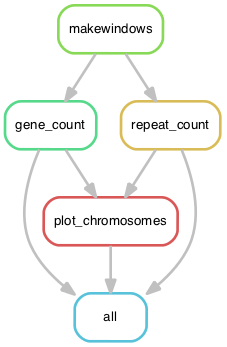

Snakemake pipeline with the purpose to count number of genes and repetitive DNA across the chromosomes of the genomes
and to make a plot showing the entire chromosomes and values of windows

The resulting figure is shown in the [main page](https://github.com/alexzaccaron/2023_cfulv_pangen/tree/main) of this repository.

A rule graph is shown below, produced with:

```
snakemake -n --rulegraph | dot -Tpng > dag.png
```

