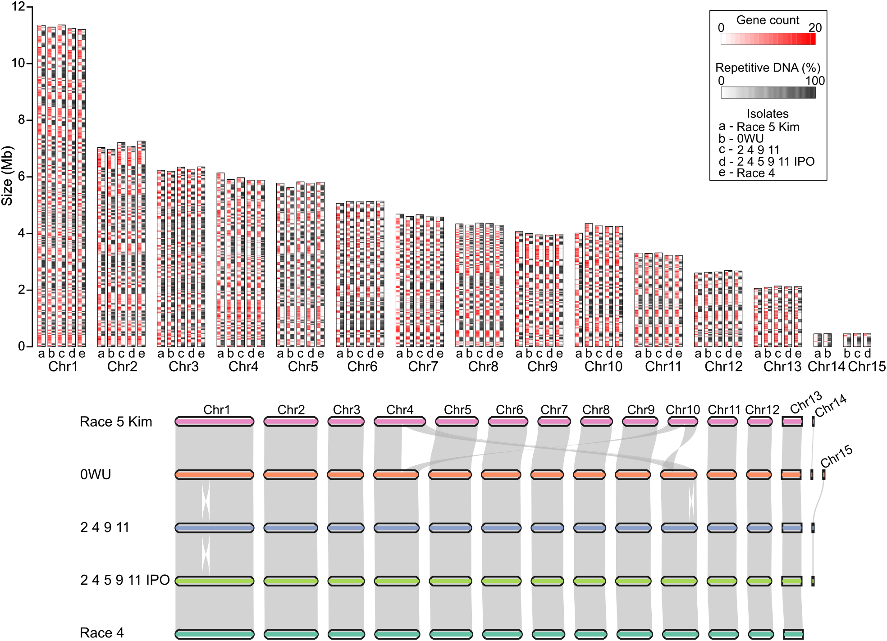

# Comparison of five near-complete genome assemblies of the tomato pathogen *Cladosporium fulvum*

This repository contains scripts and code snippets used for the comparative analysis of five chromosome-scale genome assemblies of the tomato pathogen C. fulvum. Each folder refers to a Section of the results of the main manuscript.

